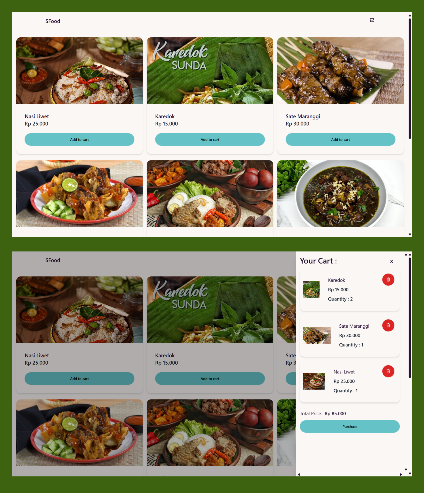

<div align="center" id="top"> 
  

&#xa0;

  <!-- <a href="https://sveltekitecommerce.netlify.app">Demo</a> -->
</div>

<h1 align="center">Sveltekit Ecommerce</h1>

<p align="center">
  

  

  

  

  

  

  
</p>

<hr>

<p align="center">
  <a href="#dart-about">About</a> &#xa0; | &#xa0; 
  <a href="#rocket-technologies">Technologies</a> &#xa0; | &#xa0;
  <a href="#white_check_mark-requirements">Requirements</a> &#xa0; | &#xa0;
  <a href="#checkered_flag-starting">Starting</a> &#xa0; | &#xa0;
  <a href="#memo-license">License</a> &#xa0; | &#xa0;
  <a href="https://github.com/{{YOUR_GITHUB_USERNAME}}" target="_blank">Author</a>
</p>

<br>

## :dart: About

Sveltekit Ecommerce merupakan project awal yang ingin saya buat dengan lebih baik lagi. Project ini sebagai bahan belajar dalam membuat sebuah Ecommerce sederhana.

## :rocket: Technologies

The following tools were used in this project:

- [Node.js](https://nodejs.org/en/)
- [Sveltekit](https://kit.svelte.dev/)
- [Daisy UI](https://daisyui.com/)
- [Midtrans](https://midtrans.com/)

## :white_check_mark: Requirements

Before starting :checkered_flag:, you need to have [Git](https://git-scm.com) and [Node](https://nodejs.org/en/) installed.

## :checkered_flag: Starting

```bash
# Clone this project
$ git clone https://github.com/suryamsj/sveltekit-ecommerce

# Access
$ cd sveltekit-ecommerce

# Install dependencies
$ npm install

# Run the project
$ npm run dev

# The server will initialize in the <http://localhost:5173>
```

## :memo: License

This project is under license from MIT. For more details, see the [LICENSE](LICENSE) file.

Made with :heart: by <a href="https://github.com/suryamsj" target="_blank">Muhammad Surya J</a>

&#xa0;

<a href="#top">Back to top</a>
